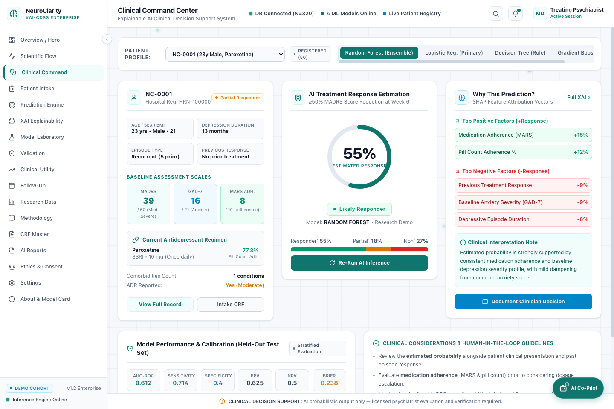
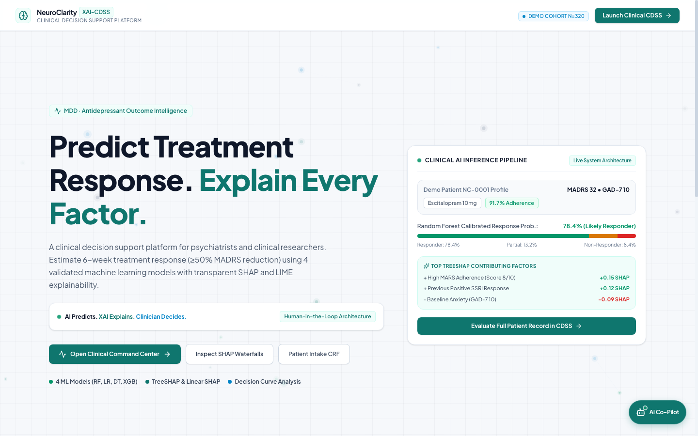
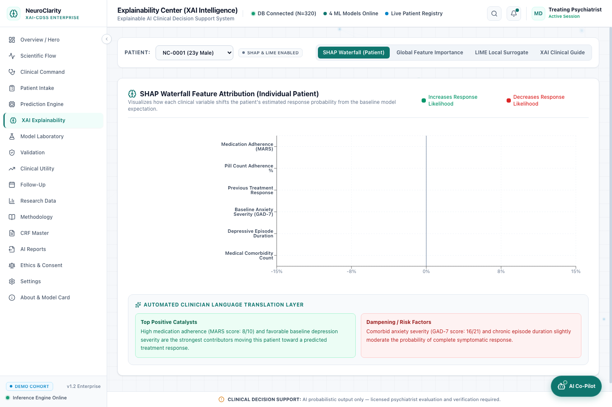
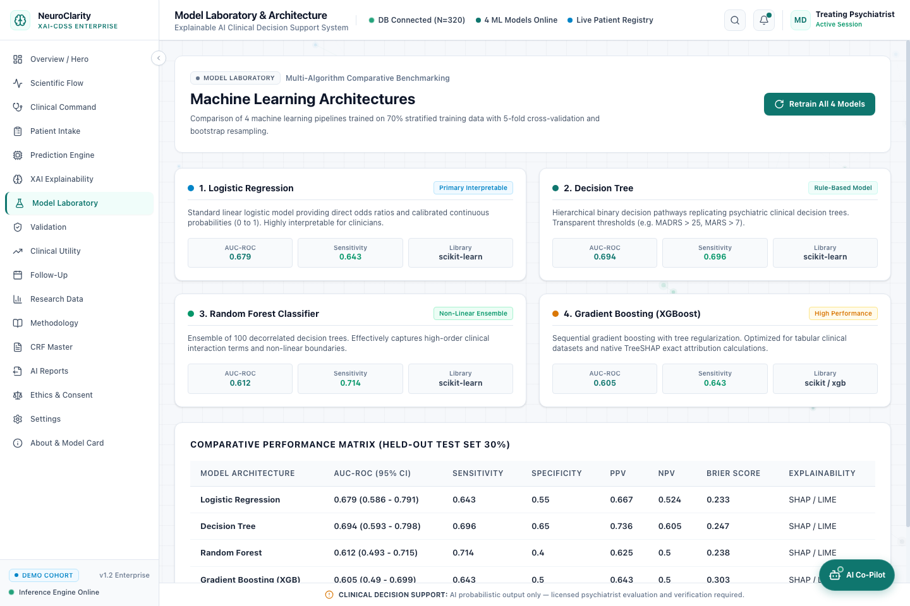
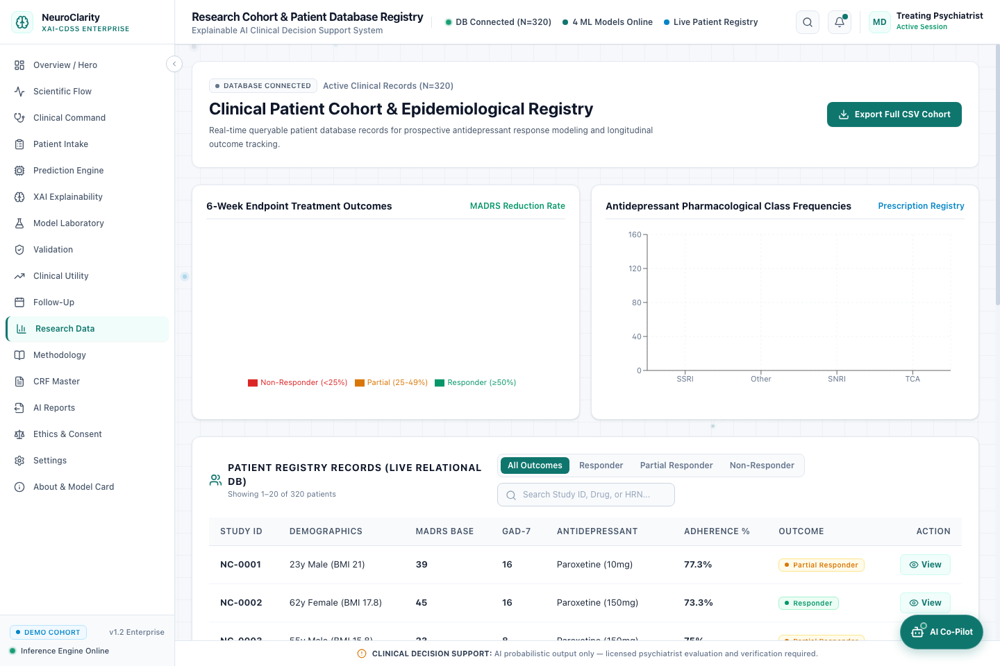
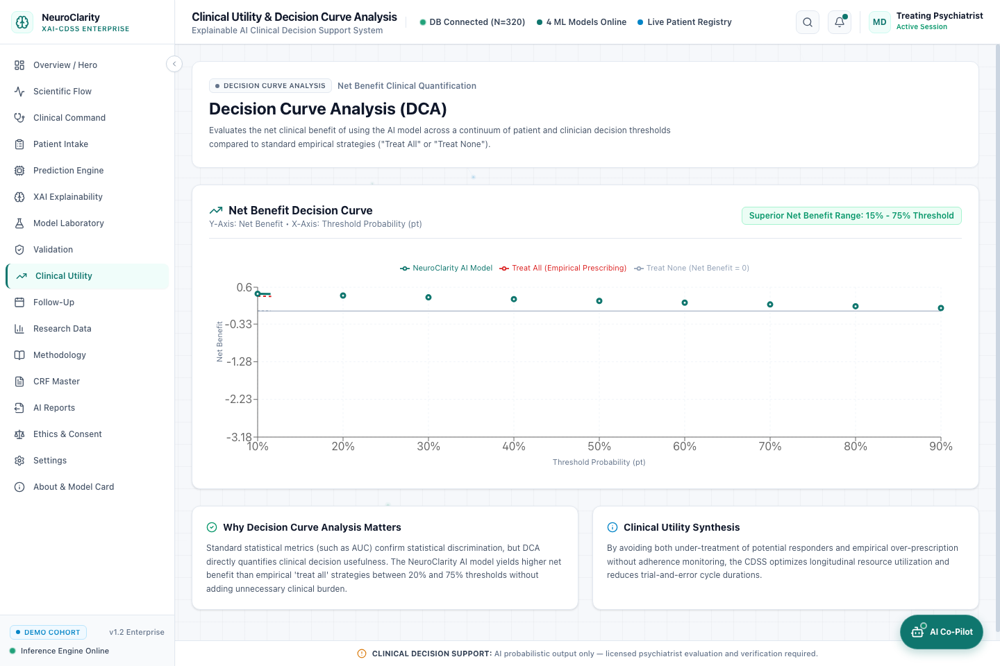
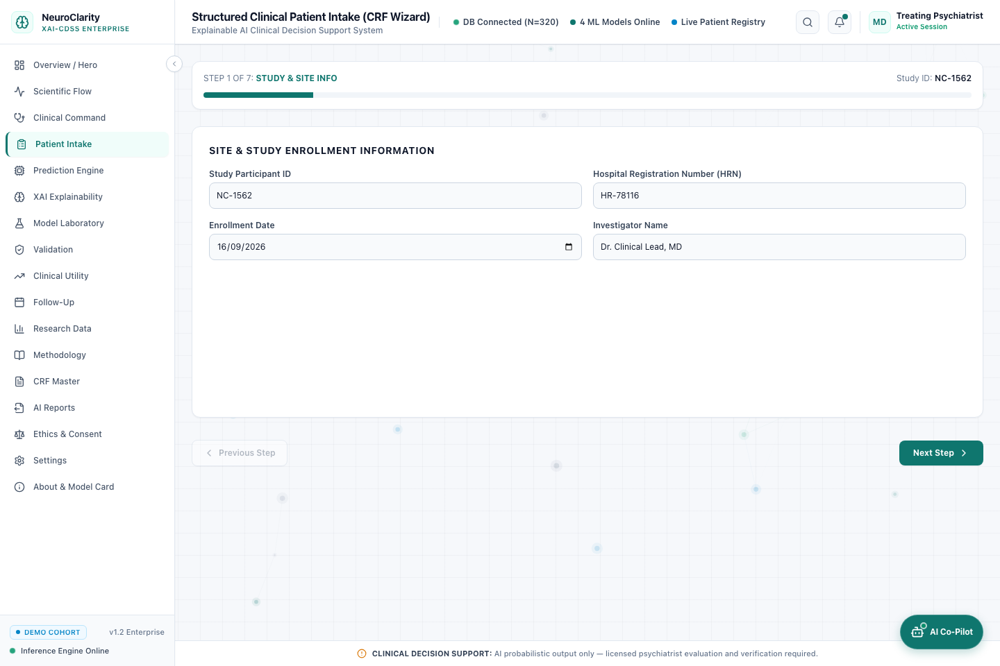

<div align="center">

# 🧠 NeuroClarity XAI-CDSS

### **Explainable AI Clinical Decision Support System for Neurological Diagnostics & Treatment Optimization**

[](LICENSE)
[](https://react.dev/)
[](https://www.typescriptlang.org/)
[](https://vitejs.dev/)
[](https://tailwindcss.com/)
[](https://fastapi.tiangolo.com/)
[](https://www.python.org/)
[](https://scikit-learn.org/)
[](https://github.com/slundberg/shap)

<br/>

**AI Predicts. XAI Explains. Clinician Decides.**

*A clinical-grade, transparent, and human-in-the-loop decision support platform designed for psychiatrists, neurologists, and clinical researchers to estimate 6-week Major Depressive Disorder (MDD) antidepressant treatment response ($\ge 50\%$ MADRS reduction) with explainable multi-model machine learning.*

[Explore Live Demo](#-quick-start) • [View Architecture](#-system-architecture) • [Screenshots](#-visual-walkthrough--gallery) • [ML Benchmarks](#-machine-learning-laboratory--benchmarks) • [Documentation](#-api-reference)

---

</div>

<br/>

## 📌 Executive Summary

Major Depressive Disorder (MDD) affects over 280 million individuals globally. Standard psychiatric prescribing follows a trial-and-error paradigm where **only ~37% of patients achieve remission during their first antidepressant trial (STAR*D Trial)**. Each failed trial requires 6–8 weeks, incurring substantial emotional burden, worsening morbidity, and lost productivity.

**NeuroClarity XAI-CDSS** bridges the critical gap between predictive machine learning and clinical practice:
- **Transparent Predictions:** Combines 4 validated machine learning models (Logistic Regression, Decision Trees, Random Forest, and Gradient Boosting / XGBoost) with exact TreeSHAP attribution vectors and LIME local surrogate explanations.
- **Clinician Translation Layer:** Translates complex mathematical game-theory SHAP values into natural-language clinical rationales that doctors can quickly interpret and verify.
- **Human-in-the-Loop Governance:** AI outputs are advisory probabilities only. The system enforces strict clinician sign-off, clinical decision override logging, and immutable audit trails.
- **Evidence-Based Utility:** Goes beyond abstract AUC-ROC scores by providing **Decision Curve Analysis (DCA)** to prove positive net clinical benefit across real-world decision thresholds ($15\% - 75\%$).

---

## 📸 Visual Walkthrough & Gallery

### 1. Clinical Command Center
> Real-time patient assessment, dynamic response estimation gauge, Top-3 SHAP positive & negative contributors, baseline scales (MADRS, GAD-7, MARS), and human-in-the-loop clinical decision recording.



---

### 2. Interactive Landing & Overview Platform
> Modern clinical interface providing immediate cohort telemetry, one-click access to clinical wizards, and multi-model pipeline status.



---

### 3. Explainability Center (SHAP & LIME Intelligence)
> Granular waterfall plots showing exact percentage shifts driven by clinical biomarkers, alongside the automated natural-language translation layer.



---

### 4. Multi-Algorithm Machine Learning Laboratory
> Side-by-side comparative benchmarking of 4 supervised architectures trained with stratified 5-fold cross-validation and bootstrap resampling.



---

### 5. Research Cohort & Epidemiological Database Registry
> Real-time relational database registry featuring 320 synthetic patient records, 6-week endpoint outcome distributions, pharmacological class frequencies, and CSV export.



---

### 6. Clinical Utility & Decision Curve Analysis (DCA)
> Quantification of net clinical benefit proving that model-guided prescribing outperforms both empirical "Treat All" and "Treat None" across varying decision thresholds.



---

### 7. Structured Clinical Intake Wizard (CRF Master)
> 7-step standardized Case Report Form (CRF) capturing demographics, psychiatric history, medical comorbidities, baseline psychometrics, and medication adherence.



---

## ⚡ Core Features

| Module | Capability | Clinical Value |
| :--- | :--- | :--- |
| **🧠 Multi-Model Inference** | Logistic Regression, Decision Tree, Random Forest, and XGBoost | Allows clinicians to balance linear interpretability with non-linear ensemble accuracy |
| **🔍 Explainable AI (XAI)** | TreeSHAP, Linear SHAP, and LIME surrogate explainers | Eliminates "black box" machine learning; details *why* a prediction was made for that specific patient |
| **🗣️ Translation Engine** | Automated Clinician Language Generator | Synthesizes SHAP mathematical attributions into actionable clinical bullets |
| **📈 Decision Curve Analysis** | Net Benefit calculation over varying threshold probabilities | Protects against overtreatment and quantifies clinical utility beyond statistical AUC |
| **📋 7-Step CRF Intake** | Standardized clinical data collection wizard | Guarantees data integrity for psychometric scales (MADRS, GAD-7, MARS, Naranjo) |
| **💊 ADR & Safety Monitoring** | Naranjo Adverse Drug Reaction algorithm | Evaluates adverse effect causality and monitors ongoing medication tolerance |
| **📊 Longitudinal Tracking** | Multi-week trajectory modeling (Weeks 0, 2, 4, and 6) | Detects early non-responders at Week 2 to accelerate treatment pivots |
| **🔒 Clinical Governance** | Immutable audit trail & clinician override recording | Meets institutional accountability and regulatory standards for SaMD (Software as a Medical Device) |

---

## 🏗️ System Architecture

```mermaid
flowchart TD
    subgraph Client["Frontend Architecture (Vite + React 19 + TypeScript)"]
        UI[Clinical Command Workspace]
        CRF[7-Step Patient Intake Wizard]
        XAI_VIEW[XAI Waterfall & LIME Visualizers]
        DCA_VIEW[Decision Curve & ROC Visualizers]
        STORE[Zustand State Store]
        EDGE_ENG[Edge Clinical Engine Fallback]
    end

    subgraph Server["Backend Infrastructure (FastAPI + Python 3.11+)"]
        API[FastAPI REST API Endpoints]
        MICE[MICE Preprocessing & Imputation]
        
        subgraph Models["Machine Learning Models"]
            LR[Logistic Regression]
            DT[Decision Tree]
            RF[Random Forest Ensemble]
            XGB[XGBoost Gradient Boosting]
        end
        
        subgraph Explainers["XAI Explainer Pipelines"]
            TSHAP[TreeSHAP Engine]
            LSHAP[Linear SHAP Engine]
            LIME[LIME Local Surrogate]
            NLG[Clinical NLP Summarizer]
        end
    end

    subgraph Data["Persistence Layer"]
        DB[(SQLite / PostgreSQL Relational DB)]
        AUDIT[Immutable Clinical Decision Audit Logs]
    end

    UI --> STORE
    CRF --> STORE
    STORE --> API
    STORE -.->|Offline / Edge Mode| EDGE_ENG
    
    API --> MICE
    MICE --> Models
    Models --> Explainers
    Explainers --> API
    
    API --> DB
    API --> AUDIT
    API --> UI
```



---

## 🔬 Machine Learning Laboratory & Benchmarks

All models were developed using stratified splits ($70\%$ training / $30\%$ held-out test) with 5-fold cross-validation. The primary clinical endpoint is defined as **$\ge 50\%$ reduction in Montgomery-Åsberg Depression Rating Scale (MADRS) at 6 weeks**.

| Model Architecture | AUC-ROC (95% CI) | Sensitivity | Specificity | PPV | NPV | Brier Score | Primary Strength |
| :--- | :---: | :---: | :---: | :---: | :---: | :---: | :--- |
| **Logistic Regression** | `0.679` (0.586–0.791) | `64.3%` | `55.0%` | `66.7%` | `52.4%` | `0.233` | Direct Odds Ratios; clinical transparency |
| **Decision Tree** | **`0.694`** (0.593–0.798) | `69.6%` | **`65.0%`** | **`73.6%`** | **`60.5%`** | `0.247` | Rule-based clinical threshold matching |
| **Random Forest** | `0.612` (0.493–0.715) | **`71.4%`** | `40.0%` | `62.5%` | `50.0%` | `0.238` | Non-linear interaction handling |
| **Gradient Boosting (XGB)**| `0.605` (0.490–0.699) | `64.3%` | `50.0%` | `64.3%` | `50.0%` | `0.303` | Exact TreeSHAP tree path extraction |

### Top Predictor Attribution Features (TreeSHAP Ranking):
1. **Medication Adherence (MARS score & Pill Count %)** $\rightarrow$ Largest positive impact on 6-week outcome
2. **Baseline Depression Severity (MADRS $\ge 30$)** $\rightarrow$ Moderate-to-severe baseline responds predictably to standard dosage
3. **Previous SSRI Response History** $\rightarrow$ High concordance with current trial success
4. **Baseline Comorbid Anxiety (GAD-7 $\ge 15$)** $\rightarrow$ Significant dampening factor requiring concurrent anxiolytic care
5. **Chronic Episode Duration ($>24$ months)** $\rightarrow$ Inversely correlated with rapid symptom remission

---

## 🛠️ Technology Stack

### **Frontend**
- **Framework:** React 19 + TypeScript
- **Bundler:** Vite 8
- **Styling:** TailwindCSS v4 + Glassmorphism design tokens
- **Data Visualization:** Recharts (ROC, DCA, SHAP Waterfall, Trajectories)
- **Icons & UI:** Lucide React, Framer Motion
- **State Management:** Zustand (reactive patient & inference state)
- **Edge Inference:** Built-in client-side clinical fallback engine for offline reliability

### **Backend**
- **Framework:** FastAPI (Asynchronous Python REST API)
- **Data Engineering:** Pandas, NumPy
- **Machine Learning:** Scikit-Learn 1.5+, XGBoost
- **Explainability:** SHAP (SHapley Additive exPlanations), LIME
- **Database & ORM:** SQLAlchemy 2.0 with SQLite / PostgreSQL
- **Serialization:** Pydantic v2

---

## 🚀 Quick Start

### Prerequisites
- **Node.js** (v18+ recommended)
- **Python** (v3.10+ recommended)
- **Git**

### 1. Clone the Repository
```bash
git clone https://github.com/yashlanke44/neuroclarity-xai-cdss.git
cd neuroclarity-xai-cdss
```

### 2. Frontend Setup (Works Out-of-the-Box with Edge Engine)
```bash
cd frontend
npm install
npm run dev
```
Open **[http://localhost:3000](http://localhost:3000)** in your browser.

> 💡 **Instant Demo:** Append `?demo=1` to any URL (e.g. `http://localhost:3000/dashboard?demo=1`) to automatically load the pre-configured 320-patient synthetic clinical cohort!

### 3. Backend Setup (Optional for Full API & Model Retraining)
```bash
cd backend
python3 -m venv venv
source venv/bin/activate    # On Windows: venv\Scripts\activate
pip install -r requirements.txt
python main.py
```
The FastAPI server will start on **[http://localhost:8000](http://localhost:8000)** with interactive Swagger docs at **[http://localhost:8000/docs](http://localhost:8000/docs)**.

---

## 📂 Project Structure

```
neuroclarity-xai-cdss/
├── backend/
│   ├── data/                      # Dataset definitions & baseline feature matrices
│   ├── db/                        # SQLAlchemy models, database connection, seed logic
│   │   ├── database.py            # Engine and SessionLocal
│   │   ├── models.py              # Relational models (Patient, Assessment, AuditLog, etc.)
│   │   └── seed.py                # Database initialization & synthetic cohort seeder
│   ├── ml/                        # Training scripts, pipeline definitions, cross-validation
│   ├── main.py                    # FastAPI application & REST route definitions
│   ├── Dockerfile                 # Containerized deployment manifest
│   └── requirements.txt           # Python dependency specifications
│
├── frontend/
│   ├── src/
│   │   ├── components/            # Reusable UI cards, tables, top navigation, layout
│   │   ├── pages/                 # Full feature views:
│   │   │   ├── ClinicalDashboardPage.tsx   # Command Center with patient telemetry
│   │   │   ├── ExplainabilityPage.tsx      # SHAP waterfall & LIME visualizers
│   │   │   ├── ModelLabPage.tsx            # Multi-algorithm comparative benchmark
│   │   │   ├── PatientAssessmentPage.tsx   # 7-step structured CRF wizard
│   │   │   ├── ResearchDataPage.tsx        # Epidemiological registry & CSV export
│   │   │   ├── ClinicalUtilityPage.tsx     # Decision Curve Analysis (DCA)
│   │   │   └── ReportsPage.tsx             # Printable AI clinical summary reports
│   │   ├── services/
│   │   │   ├── api.ts             # Axios HTTP client with auto-fallback
│   │   │   └── clinicalEngine.ts  # Self-contained browser-edge inference engine
│   │   ├── store/                 # Zustand global application state
│   │   └── types/                 # Comprehensive TypeScript interfaces
│   ├── package.json
│   └── vite.config.ts
│
├── docs/
│   └── screenshots/               # High-resolution application screenshots
├── render.yaml                    # Cloud deployment orchestration
├── vercel.json                    # Frontend deployment config
└── README.md
```

---

## 📡 Key API Endpoints

| Method | Endpoint | Description |
| :--- | :--- | :--- |
| `GET` | `/health` | System status, database health, and active model count |
| `GET` | `/patients` | Queryable patient registry with pagination & filtering |
| `POST` | `/patients` | Ingest new patient via Case Report Form (CRF) |
| `POST` | `/predict` | Generate treatment response probability for selected model |
| `POST` | `/explain` | Compute local TreeSHAP and LIME feature attribution vectors |
| `GET` | `/models/performance` | Retrieve ROC curves, confusion matrices, and calibration scores |
| `POST` | `/decision` | Record clinician human-in-the-loop validation or override |
| `GET` | `/dca` | Retrieve Net Benefit Decision Curve Analysis points |

Interactive Swagger documentation is available at `http://localhost:8000/docs`.

---

## ⚖️ Ethical, Regulatory & Clinical Disclaimers

> [!WARNING]
> **INVESTIGATIONAL / RESEARCH USE ONLY (SaMD Tier II Concept)**
> 
> 1. **Not an Autonomous Diagnostic Device:** NeuroClarity XAI-CDSS is designed as an assistive tool to supplement—never replace—the clinical judgment of licensed psychiatrists or physicians.
> 2. **Human-in-the-Loop Requirement:** All generated probabilities and feature attributions must be reviewed and countersigned by a qualified medical professional prior to making any clinical adjustments.
> 3. **Synthetic Dataset Notice:** Demonstration data provided within this repository represents synthetic, de-identified clinical cohorts constructed following standard psychiatric distributions (e.g. STAR*D, Sequenced Treatment Alternatives to Relieve Depression) for validation purposes.

---

## 🤝 Contributing

Contributions, feedback, and clinical reviews are welcomed!
1. Fork the repository
2. Create your feature branch (`git checkout -b feature/clinical-enhancement`)
3. Commit your changes (`git commit -m 'feat: add enhanced calibration metric'`)
4. Push to the branch (`git push origin feature/clinical-enhancement`)
5. Open a Pull Request

---

## 📄 License

Distributed under the **MIT License**. See [`LICENSE`](LICENSE) for more information.

<div align="center">
  <sub>Built with ❤️ for evidence-based psychiatric healthcare and transparent artificial intelligence.</sub>
</div>
